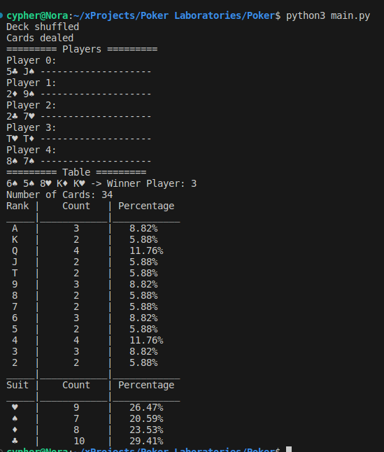

# Poker AI

## Overview

This project aims to develop a Poker AI using Python 3.10. The AI will be capable of playing various poker variants and making strategic decisions based on the game state.

## Features

- **Game Variants**: The AI will support different variants of poker, such as Texas Hold'em, Omaha, etc.
- **Player Interaction**: Users can interact with the AI through a user-friendly interface.
- **Strategy Development**: Implement various strategies for decision-making, including basic strategies and more advanced techniques.
- **Privacy Considerations**: The model component has been removed to address privacy concerns. This ensures that the AI does not store or utilize sensitive data.
- Python 3.10

## Usage

```bash
python3 main.py
```

## Sample Game


